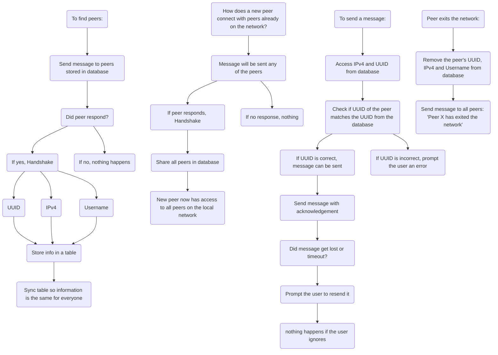

```mermaid
graph TD;
    A(To find peers:) --> A1(Send message to peers stored in database)--> A2(Did peer respond?) --> A3(If yes, Handshake)
    A2(Did peer respond?) --> A4(If no, nothing happens)
    A3(If yes, Handshake) --> A6(UUID)
    A3(If yes, Handshake) --> A7(IPv4 )
    A3(If yes, Handshake) --> A8(Username)
    A6(UUID)-->A5(Store)
    A7(IPv4 )-->A5(Store)
    A8(Username)-->A5(Store info in a table)
    A5(Store info in a table)-->A9(Sync table so information is the same for everyone)
    
    B(How does a new peer connect with peers already on the network?)-->B1(Message will be sent any of the peers)
    B1(Message will be sent any of the peers)-->B2(If peer responds, Handshake)
    B1(Message will be sent any of the peers)-->B3(If no response, nothing)
    B2(If peer responds, Handshake)-->B4(Share all peers in database)
    B4(Share all peers in database) --> B5(New peer now has access to all peers on the local network)
    
    C(To send a message:) --> C1(Access IPv4 and UUID from database) --> C2(Check if UUID of the peer matches the UUID from the database)-->C3(If UUID is correct, message can be sent)
    -->C5(Send message with acknowledgement)-->C6(Did message get lost or timeout?)-->C7(Prompt the user to resend it)-->C8(nothing happens if the user ignores)
    C2(Check if UUID of the peer matches the UUID from the database)-->C4(If UUID is incorrect, prompt the user an error)
    
    D(Peer exits the network:) --> D1(Remove the peer's UUID, IPv4 and Username from database) --> D2(Send message to all peers: 'Peer X has exited the network')
    
    
```
