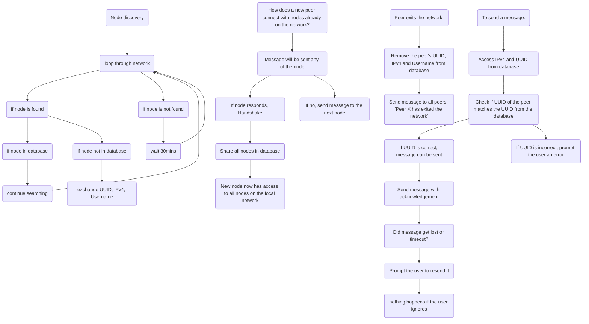

```mermaid
graph TD; 

    
    A(Node discovery) --> A10(loop through network)
    A10--> A1(if node is found)
    A10 -->A2(if node is not found)
    A1 --> A12(if node in database)
    A12--> A20(continue searching)
    A20-->A10
    A1 --> A13(if node not in database)
    A13--> A4(exchange UUID, IPv4, Username)
    A2 --> A11(wait 30mins)
    A11 --> A10
    
    B(How does a new peer connect with nodes already on the network?)-->B1(Message will be sent to any of the nodes)
    B1(Message will be sent any of the nodes)-->B2(If node responds, Handshake)
    B1(Message will be sent any of the node)-->B3(If no, send message to the next node)
    B2(If node responds, Handshake)-->B4(Share all nodes in database)
    B4(Share all nodes in database) --> B5(New node now has access to all nodes on the local network)
    
    C(To send a message:) --> C1(Access IPv4 and UUID from database) --> C2(Check if UUID of the peer matches the UUID from the database)-->C3(If UUID is correct, message can be sent)
    -->C5(Send message with acknowledgement)-->C6(Did message get lost or timeout?)-->C7(Prompt the user to resend it)-->C8(nothing happens if the user ignores)
    C2(Check if UUID of the peer matches the UUID from the database)-->C4(If UUID is incorrect, prompt the user an error)
    
    D(Peer exits the network:) --> D1(Remove the peer's UUID, IPv4 and Username from database) --> D2(Send message to all peers: 'Peer X has exited the network')
    
    
```
