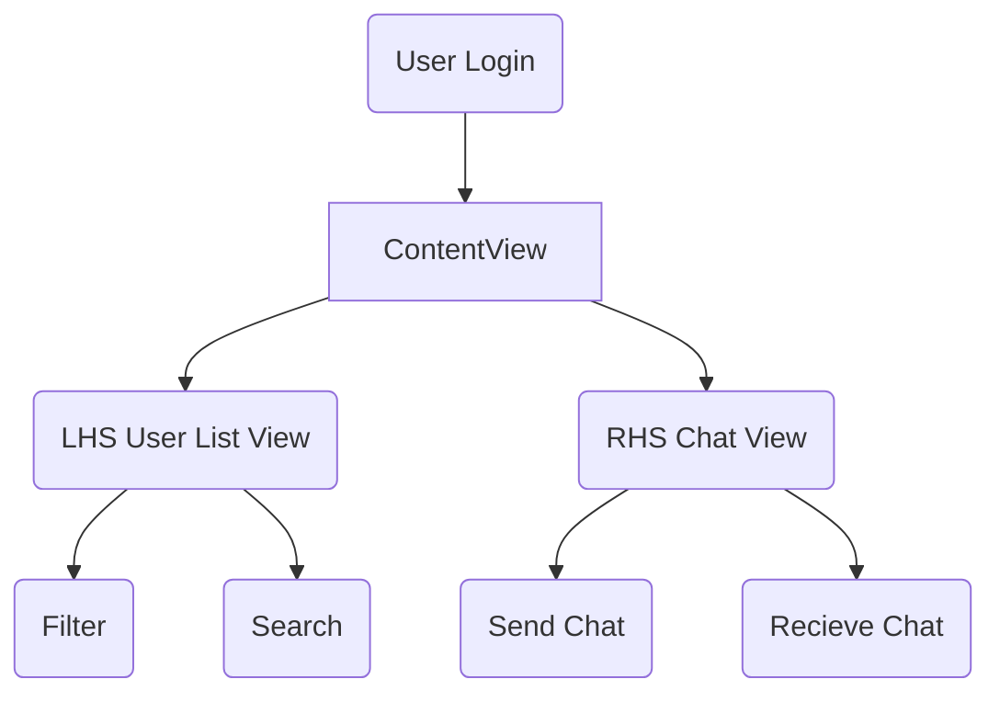

# SwiftUI Features, and Architecture 3/6
## By Kyle Gavin 

For the last week we have been working on ideating on a UI Layout for out Chat App. With SwiftUI, It is a realativley simple process to get a basic structure up and running. The follow code snipped is a very basic sudo-code outline (That also happens to compile 😉). After the user authenticates, the ContentView brings users directly to a Left-Hand Side (LHS) Collumn which displays the identified users currently or previously on the local network. The Right-Hand Side (RHS) Collumn will display the selected Chat based on user input, and allow the user to send messages. 
```
struct ContentView: View {
    
    var body: some View {
        NavigationView {
            listView()
            chatView()
        }
        .frame(maxWidth:650, maxHeight:350)
    
        
    }
}


struct listView: View {
    var body: some View {
        Text("This is the ListView")
       
    }
}
struct chatView: View {
    var body: some View {
        Text("Selected Chat will Populate Here")
            
    }
}
```
SwiftUI features layout methods called Vertical Stack (VStack), Horizontal Stack (HStack), and Back-to-Front Stack (ZStack). Within each view structure usage of a VStack embedded with an HStack allows you to dynamically generate discovered users with a for loop.
```
struct listView: View {
    var body: some View {
    VStack() {
        For User : users {
        HStack() {
        Text(users.name)
        }
        .padding()
        }    
    }  
}
```
Similarly, you're albe to display chat messages, with send/recieved chats on the respective side using the .allignment methods. With these features combined I was able to complete a variety of sucessful test builds that display sudo data. 

Along with the utilities provided natievly with SwiftUI, we also decided to encorporate SF Symbols which is Apples native symbol library. This Library includes over 3000 symbols and shapes that will allows us to create a clean UI that matches the MacOS scheme. 

### User Interaction Flow Chart



# Weekly Progress 3/1
## By Deaz Nunoo
For this week we gave out roles and assigned tasks to each member of our team. It was decided that Kyle, Joshua and Gustavo would be working on the frontend, while me and Pride worked on the backend.

# Weekly Progress 2/21
## By Gustavo Lopez
We had our first of two meetings on Tuesday during common hour. During this meeting, we discussed our blog, research we had found, and made it our priority to fix and resubmit the problem statement. Topics such as ports, JSON, encryption, and API calls/headers were to be reviewed before our second meeting. Tuesday's class helped me visualize a bit of what our project will look like. It helped me understand how servers have to be running before client and server connections can even be made. We met again on Friday and discussed our goals for the weekend which were to do the peer assessment before 8pm on Sunday, make sure the blog is up to date and most importantly, create a server and run a client test to make the sure the server works. After Kyle was able to get a server running on python, my groupmates and I were able to connect to it from our computers. This week, we met for a third time on Sunday. During this meeting we discussed the advantages of implementing an application that is accessible locally on a LAN server as opposed to a global server. We slightly discussed strategies for implementing both our back and front ends. We are pretty set on going with py2app for our front-end implementation. With py2app, we'd be able to create a stand-alone application that is accessible from any mac. The best part about it is that we can do it all from the terminal as long we have our python code written.

# Ideating on p2p implemntation 2/21
## By Kyle Gavin 
Over the weekend I spent time researching topics regarding p2p networks, their structure, and identifying common strategies for implementation. Originally, we came up with the idea of a hybrid network for file transfer, messaging. etc. that relies on an addressing server to sync clients. While this allows clients to connect without explicitly entering each other's IP addresses, in the case of failure of the addressing system the program would still work properly. After doing a light mock-up test of this type of structure I realized that this wouldn't be feasible. Chat apps by nature are simpler as a client-server model because you send a message to a server and the server has a target user with a UUID. UUIDs are used to identify people uniquely as the possibility of two instances generating the same UUID is extremely low. 

Anyhow, a peer-to-peer network on LAN works better because this removes the need for a sync server. This ultimately makes the decision to stick to a LAN-based application more logical. With this LAN-based application, we will also be able to use similar protocols to implement a file share (if desired) along with chat.

# Problem Statement 
Users at Delaware State University need an alternative to GroupMe for class group chats. This is because GroupMe does not provide end-to-end encryption, therefore making it insecure.


